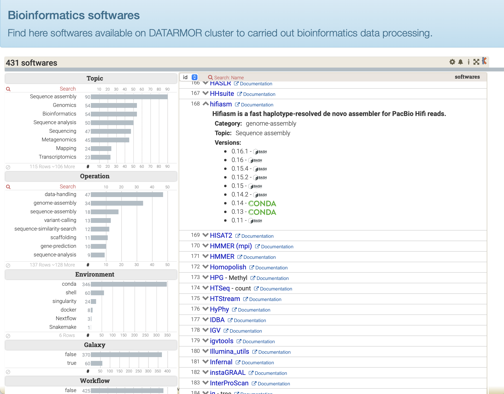

## Introduction

This repository contains the Katalog library aims at displaying list of softwares using facetted data visualization system. 



Bioinformatics tool management is a crucial task for bioinformatics platforms to have a comprehensive view of all tools available on an infrastructure. It should enable administrators and users to easily navigate through the tool catalog and save time finding appropriate tools. This requires maintaining a list of softwares in a simple and automatic way after a new installation. In addition, in order to allow end-users to quickly find a tool that fits their needs, it must allow a description and a categorization of each software by the use of various metadata.  The latter will improve software classification and allow search and navigation via other criteria, such as the packaging of the tool (compiled source code, Conda package, Singularity image, etc.), the operations allowed by the tool (assembly, search for sequence similarity, mapping, etc.) or the life science subject (sequence assembly, sequence analysis, epigenetics, phylogenetics).

Katalog project relies on the faceted viewing system called [Keshif](https://github.com/adilyalcin/Keshif), on which we have added additional elements to display a catalog of softwares. The different facets are associated to software metadata and make it possible to filter tools very quickly allowing a more efficient and multi-criteria search.

## About Katalog

This repository contains the Katalog library aims at displaying list of softwares (or databanks) using facetted data visualization system. It relies on the open-source [Keshif](https://github.com/adilyalcin/Keshif) software.

## Installation

Katalog is basically a web-based application. It can be installed and tested quite easily as follows:

```
cd /a/path/visible/to/a/web/server
git clone \<Katalog-project\> ToolDirectory
cd ToolDirectory
cp examples/Ifremer-ToolDirectory-index.html ./index.html
cp exemples/Ifremer-Softwares.csv ./Software.html
```

Now, switch to your web browser and simply open the URL targetting 'ToolDirectory/index.html' file and you should see something like the above picture.

You can also review our [public demo](https://ifremer-bioinformatics.github.io/ToolDirectorySample/).

## Adapt list of softwares

Katalog visualization relies on a spectific CSV formated data file called: [Software.csv](examples/Ifremer-Softwares.csv)

You can review the expected data format by having a look at that file which lists the bioinformatics softwares managed by SeBiMER (Ifremer's Bioinformatics Core Facility) on Ifremer's DATARMOR supercomputer.

You can easily create a Software.csv file using one of:
- your own little script that will be capable of compiling the tools installed on your platform;
- use the companion tool of Katalog: [ToolDirectory](https://github.com/ifremer-bioinformatics/ToolDirectory)

## About Keshif

Mehmet Adil Yalcin @ HCIL, University of Maryland, College Park. Funded in part by Huawei (2013-2014). BSD 3 clause (c) University of Maryland 2014-2016

